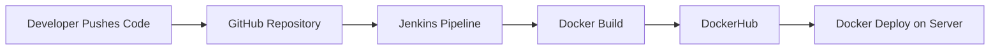
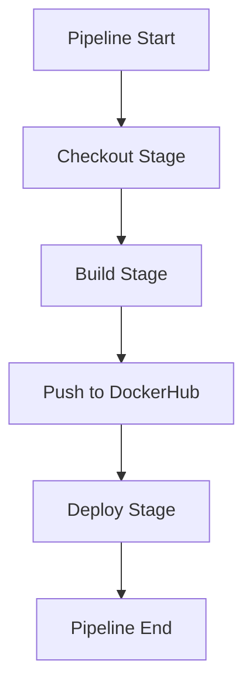
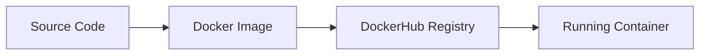
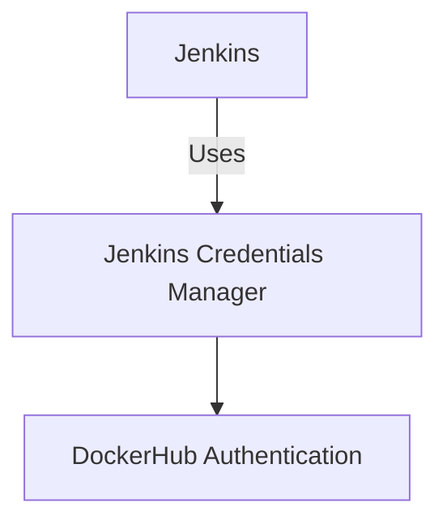
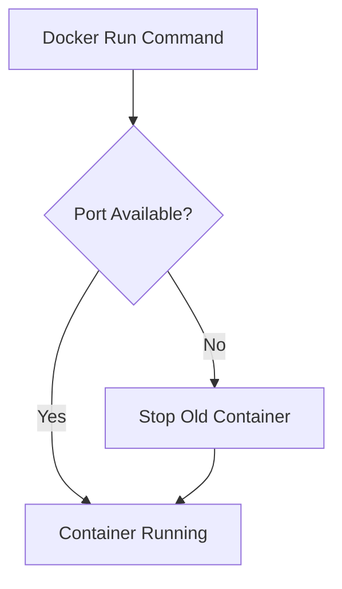

# 🚀 Jenkins CI/CD Pipeline with Docker (End-to-End)

## 📌 Project Overview

This project demonstrates a **complete CI/CD pipeline** built using **Jenkins**, **Docker**, and **DockerHub**. The pipeline automates the full lifecycle of an application — from **source code checkout** to **build**, **image push**, and **deployment**.

This work reflects real-world DevOps practices, including secure credential management, containerization, and automated deployment.

---

## 🧑‍💻 What I Did (Today’s Work Summary)

Today, I designed and implemented an **end-to-end Jenkins Declarative Pipeline** that:

1. Pulls source code from GitHub automatically
2. Builds a Docker image using Docker Buildx
3. Pushes the image securely to DockerHub
4. Deploys the application as a Docker container
5. Handles real-world deployment issues like port conflicts

This pipeline eliminates manual steps and ensures **consistent, repeatable, and reliable deployments**.

---

## 🛠️ Tech Stack Used

* **Jenkins** – CI/CD automation
* **GitHub** – Source code repository
* **Docker & Docker Buildx** – Containerization
* **DockerHub** – Image registry
* **Linux (Ubuntu)** – Jenkins agent & deployment server
* **Credentials Manager** – Secure secrets handling

---

## 🔁 CI/CD Pipeline Stages Explained

### 1️⃣ Checkout Stage

* Jenkins clones the source code from the GitHub repository
* Ensures the pipeline always works with the latest code

### 2️⃣ Build Stage

* Docker Buildx is used to build the application image
* Application is packaged into a reusable Docker image

### 3️⃣ Push to DockerHub

* Jenkins logs into DockerHub using **secure credentials**
* Built image is tagged and pushed to DockerHub

### 4️⃣ Deploy Stage

* Docker container is started using the pushed image
* Application is exposed on a specific port
* Pipeline handles port conflicts gracefully

### 5️⃣ Post Actions

* Pipeline reports final status after execution

---

## 🔐 Security Best Practices Followed

* No hardcoded passwords in the pipeline
* DockerHub credentials stored in Jenkins Credentials Manager
* Environment variables used for sensitive data

---

## ⚠️ Real-World Issue Faced & Solution

### Issue:

* Docker container failed to start due to **port 8000 already in use**

### Solution:

* Identified the running process/container using the port
* Stopped and removed the old container
* Updated deployment logic to avoid conflicts

This reflects **production-level troubleshooting skills**.

---

## 📊 Architecture & Flow Diagrams (Mermaid)

### 🟦 Diagram 1: High-Level CI/CD Flow

---

### 🟩 Diagram 2: Jenkins Pipeline Stages

---

### 🟨 Diagram 3: Docker Image Lifecycle

---

### 🟧 Diagram 4: Credential Security Flow

---

### 🟥 Diagram 5: Deployment & Port Handling

---

## 🧠 Key Learnings

* How to design a **production-ready CI/CD pipeline**
* Secure handling of credentials in Jenkins
* Docker image build and registry workflows
* Debugging and fixing real deployment issues
* Writing clean and maintainable Jenkinsfiles

---

## 🌟 One-Line Project Summary

> Built a full Jenkins CI/CD pipeline that automates GitHub checkout, Docker image build, secure DockerHub push, and container-based deployment with real-world error handling.

---

## 🔗 Connect With Me (Attractive Links)

👨‍💻 **GitHub:** 🔗 [https://github.com/arkantandel](https://github.com/arkantandel)

🐳 **DockerHub:** 🔗 [https://hub.docker.com/u/arkantandel](https://hub.docker.com/u/arkantandel)

💼 **LinkedIn:** 🔗 [https://www.linkedin.com/in/arkantandel](https://www.linkedin.com/in/arkantandel)

📧 **Email:** 📩 [arkan.tandel.devops@gmail.com](mailto:arkan.tandel.devops@gmail.com) *(replace if needed)*

> ⭐ If you like this project, don’t forget to **star the repository** and connect with me. I regularly share hands-on DevOps projects and real-world CI/CD implementations.

---

## 🙌 Final Note

This project reflects **continuous learning, consistency, and hands-on DevOps practice**. Each pipeline run improves reliability and confidence in automated deployments.

---

💪 *I am continuously improving my DevOps skills through real-world projects and problem-solving.*
